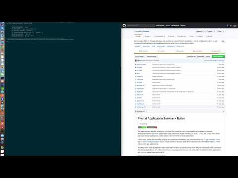

# Pivotal Application Service > Butler

[](https://github.com/badges/stability-badges) [](https://travis-ci.org/pacphi/cf-butler) [](https://snyk.io/test/github/pacphi/cf-butler) [](https://opensource.org/licenses/Apache-2.0)


You are a platform operator working for a Fortune 500 enterprise.  You've witnessed first-hand how the product development teams your team supports are super productive; happily invoking `cf push`, `cf cs` and `cf bs` many times per day to deploy applications, create services and bind them to those applications.

This is great, except that over time, on your non-production foundations, as you've browsed organizations and spaces, you have noticed a large number of stopped application instances and orphaned services (i.e., those not bound to any applications).

Reaching out to each development team to tell them to clean-up has become a chore.  Why not implement some automation that allows you a) to obtain snapshot and usage reports and b) define and enforce some house-keeping policies for your non-production foundations where applications and services are perhaps more volatile?

This is where `cf-butler` has your back.

## What does it do?

Please take 5-10 mintues to view this short video demonstration to get a sense of what `cf-butler` can do.

[](https://youtu.be/IyLJfC6N60Q)

### tl;dr

Cf-butler exposes a number of self-service endpoints that perform house-keeping for your foundation.  You define policies and an execution schedule.  Then applications and service instances are removed based on policy crtieria.  Cf-butler also provides detail and summary snapshot reporting on all applications, service instances, user accounts, organizations and spaces.  Lastly, cf-butler aspires to provide operators insight into freshness of installed tiles, stemcells and buildpacks.

## Prerequisites

Required

* [Pivotal Network](https://network.pivotal.io) account
* [Pivotal Application Service](https://pivotal.io/platform/pivotal-application-service) admin account

Optional

* [Pivotal Operations Manager](https://pivotal.io/platform/pcf-components/pcf-ops-manager) admin account


## Tools

* [git](https://git-scm.com/downloads) 2.20.1 or better
* [JDK](http://openjdk.java.net/install/) 11 or better
* [cf](https://docs.cloudfoundry.org/cf-cli/install-go-cli.html) CLI 6.41.0 or better
* [uaac](https://github.com/cloudfoundry/cf-uaac) 4.1.0 or better


## Clone

```
git clone https://github.com/pacphi/cf-butler.git
```


## How to configure

Make a copy of then edit the contents of the `application.yml` file located in `src/main/resources`.  A best practice is to append a suffix representating the target deployment environment (e.g., `application-pws.yml`, `application-pcfone.yml`). You will need to provide administrator credentials to Apps Manager for the foundation if you want the butler to keep your entire foundation tidy.

> You really should not bundle configuration with the application. To take some of the sting away, you might consider externalizing and/or [encrypting](https://blog.novatec-gmbh.de/encrypted-properties-spring/) this configuration.

### Managing secrets

Place secrets in `config/secrets.json`, e.g.,

```
{
  "PIVNET_API-TOKEN": "xxxxx"
  "CF_API-HOST": "xxxxx",
  "CF_USERNAME": "xxxxx",
  "CF_PASSWORD": "xxxxx",
}
```

We'll use this file later as input configuration for the creation of either a [credhub](https://docs.pivotal.io/credhub-service-broker/using.html) or [user-provided](https://docs.cloudfoundry.org/devguide/services/user-provided.html#credentials) service instance.

> Replace occurrences of `xxxxx` above with appropriate values

### Minimum required keys

At a minimum you should supply values for the following keys

* `cf.apiHost` - a Pivotal Application Service API endpoint
* `token.provider` - Pivotal Application Service authorization token provider, options are: `userpass` or `sso`
* `pivnet.apiToken` - a Pivotal Network legacy API Token, visit your [profile](https://network.pivotal.io/users/dashboard/edit-profile)

Based on choice of the authorization token provider

#### Username and password

* `cf.username` - a Pivotal Application Service account username (typically an administrator account)
* `cf.password` - a Pivotal Application Service account password

#### Single-sign on

* `cf.refreshToken` - the refresh token to be found within `~/.cf/config.json` after your authenticate

### General configuration notes

If you copied and appended a suffix to the original `application.yml` then you would set `spring.profiles.active` to be that suffix

E.g., if you had a configuration file named `application-pws.yml`

```
./gradlew bootRun -Dspring.profiles.active=pws
```

> See the [samples](samples) directory for some examples of configuration when deploying to [Pivotal Web Services](https://login.run.pivotal.io/login) or [PCF One](https://login.run.pcfone.io/login).

### Using an external database

By default `cf-butler` employs an in-memory [H2](http://www.h2database.com) instance.

If you wish to configure an external database you must set set `spring.r2dbc.*` properties as described [here](https://github.com/spring-projects-experimental/spring-boot-r2dbc).

Before you `cf push`, stash the credentials for your database in `config/secrets.json` like so

```
{
  "R2DBC_URL": "rdbc:postgresql://<server>:<port>/<database>",
  "R2DBC_USERNAME": "<username>",
  "R2DBC_PASSWORD": "<password>"
}
```

> Replace place-holders encapsulated in `<>` above with real credentials

Or you may wish to `cf bind-service` to a database service instance. In this case you must abide by a naming convention. The name of your service instance must be `cf-butler-backend`.

[DDL](https://en.wikipedia.org/wiki/Data_definition_language) scripts for each supported database are managed underneath [src/main/resources/db](src/main/resources/db). Supported databases are: [h2](src/main/resources/db/h2/schema.ddl) and [postgresql](src/main/resources/db/postgresql/schema.ddl).

> A sample [script](deploy.xdb.sh) and [secrets](samples/secrets.pws.with-postgres.json) for deploying `cf-butler` to Pivotal Web Services with an [ElephantSQL](https://www.elephantsql.com) backend exists for your perusal. 

### Managing policies

Creation and deletion of policies are managed via API endpoints by default. When an audit trail is important to you, you may opt to set `cf.policies.provider` to `git`.  When you do this, you shift the lifecycle management of policies to Git.  You will have to specify additional configuration, like

* `cf.policies.uri` the location of the repository that contains policy files in JSON format
* `cf.policies.commit` the commit id to pull from
* `cf.policies.filePaths` an array of file paths of policy files

Policy files must adhere to a naming convention where:

* a filename ending with `-AP.json` encapsulates an individual [ApplicationPolicy](src/main/java/io/pivotal/cfapp/domain/ApplicationPolicy.java)
* a filename ending with `-SIP.json` encapsulates an individual [ServiceInstancePolicy](src/main/java/io/pivotal/cfapp/domain/ServiceInstancePolicy.java)

A sample Github repository exists [here](https://github.com/pacphi/cf-butler-sample-config).

Have a look at [secrets.pws.json](samples/secrets.pws.json) for an example of how to configure secrets for deployment of `cf-butler` to PAS integrating with the aforementioned sample Github repository.

On startup `cf-butler` will read files from the repo and cache in a database.  Each policy's id will be set to the commit id.

### To set the operations schedule

Update the value of the `cron` properties in `application.yml`.  Consult this [article](https://www.baeldung.com/spring-scheduled-tasks) and the [Javadoc](https://docs.spring.io/spring-framework/docs/current/javadoc-api/org/springframework/scheduling/annotation/Scheduled.html#cron--) to understand how to tune it for your purposes.

> `cron` has two sub-properties: `collection` and `execution`.  Make sure `execution` is scheduled to trigger after `collection`.

### Filtering organizations

#### Blacklist

Set `cf.organizationBlackList`.  The `system` organization is excluded by default.

Edit `application.yml` and add

```
cf:
  organizationBlackList:
    - system
```

or

Add an entry in your `config/secrets.json` like

```
  "CF_ORGANIZATION-BLACK-LIST": [ "system" ]
```

#### Whitelist

Within each [ApplicationPolicy](https://github.com/pacphi/cf-butler/blob/master/src/main/java/io/pivotal/cfapp/domain/ApplicationPolicy.java) or [ServiceInstancePolicy](https://github.com/pacphi/cf-butler/blob/master/src/main/java/io/pivotal/cfapp/domain/ServiceInstancePolicy.java) you may optionally specify a list of organizations that will be whitelisted.  Policy execution will be restricted to just these organizations in the whitelist.

> If the organization whitelist is not specified in a policy then that policy's execution applies to all organizations on the foundation (except for those in the organization blacklist).

### Integration w/ Operations Manager

You must add the following configuration properties to `application-{env}.yml` if you want to enable integration with an operations manager instance

* `om.apiHost` - a Pivotal Operations Manager API endpoint
* `om.enabled` - a boolean property that must be set to `true`

> the `{env}` filename suffix above denotes the Spring Profile you would activate for your environment

or

Add entries in your `config/secrets.json` like

```
  "OM_API-HOST": "xxxxxx",
  "OM_ENABLED": true
```

## How to Build

```
./gradlew build
```

## How to Run with Gradle

```
./gradlew bootRun -Dspring.profiles.active={target_foundation_profile}
```
where `{target_foundation_profile}` is something like `pws` or `pcfone`

> You'll need to manually stop to the application with `Ctrl+C`

## How to Run with Docker

You might choose this option when experimenting with an external database provider image like [postgres](https://github.com/docker-library/postgres/blob/6c3b27f1433ad81675afb386a182098dc867e3e8/11/alpine/Dockerfile)

Build

```
docker build -t pivotalio/cf-butler:latest .
```

Run

```
docker run -it --rm -e SPRING_PROFILES_ACTIVE={env} pivotalio/cf-butler
```
> **Note**: You should have authored an `application-{env}.yml` that encapsulates the appropriate configuration within `src/main/resources` before you built the `cf-butler-{version}-SNAPSHOT.jar` artifact with Gradle

Stop

```
docker ps -a
docker stop {pid}
```
> where `{pid}` is the Docker process id

Cleanup

```
docker rm {pid}
```
> where `{pid}` is the Docker process id


## How to deploy to Pivotal Application Service

### with Username and password authorization

The following instructions explain how to get started when `token.provider` is set to `userpass`

Authenticate to a foundation using the API endpoint.

> E.g., login to [Pivotal Web Services](https://login.run.pivotal.io)

```
cf login -a https://api.run.pivotal.io
```

### with SSO authorization

The following instructions explain how to get started when `token.provider` is set to `sso`

Authenticate to a foundation using the API endpoint

> E.g., login to [PCF One](https://login.run.pcfone.io)

```
cf login -a https://api.run.pcfone.io -sso
```

Visit the link in the password prompt to retrieve a temporary passcode, then complete the login process

> E.g., `https://login.run.pcfone.io/passcode`)

Inspect the contents of `~/.cf/config.json` and copy the value of `RefreshToken`.

Paste the value as the value for `CF_REFRESH-TOKEN` in your `config/secrets.json`

```
{
  "TOKEN_PROVIDER": "sso",
  "CF_API-HOST": "xxxxx",
  "CF_REFRESH-TOKEN": "xxxxx",
}
```

### using scripts

Please review the [manifest.yml](manifest.yml) before deploying.

Deploy the app (w/ a user-provided service instance vending secrets)

```
./deploy.sh
```

Deploy the app (w/ a Credhub service instance vending secrets)

```
./deploy.sh --with-credhub
```

Shutdown and destroy the app and service instances

```
./destroy.sh
```

> Note: If you are seeing [OutOfMemory exceptions](https://dzone.com/articles/troubleshooting-problems-with-native-off-heap-memo) shortly after startup you may need to [cf scale](https://docs.run.pivotal.io/devguide/deploy-apps/cf-scale.html#vertical) the available memory for large foundations.

## Endpoints

These REST endpoints have been exposed for administrative purposes.

### Operations Manager

These endpoints are only available when the `om.enabled` property is set to `true`.  They mimic a reduced set of the [Operations Manager API](https://docs.pivotal.io/pivotalcf/2-5/opsman-api/).  For each request, the Request header must contain an Authorization bearer token.  To obtain a token, consult the [Authentication](https://docs.pivotal.io/pivotalcf/2-5/opsman-api/?shell#authentication) section of the Operations Manager API.

```
GET /products/deployed
```
> List of all tiles installed on foundation.

```
GET /products/stemcell/assignments
```
> Lists all stemcells associated with installed tiles (includes staged and available stemcell versions).

```
GET /products/om/info
```
> Returns the current version of the Operations Manager instance

### Pivotal Network

Mimics a reduced set of the [Pivotal Network API](https://network.pivotal.io/docs/api).

```
GET /store/product/catalog
```
> Retrieves a list of all products from Pivotal Network (includes buildpacks, stemcells and tiles)

```
GET /store/product/releases?latest=true
```
> Returns a list of the latest available releases for all products on Pivotal Network (includes buildpacks, stemcells and tiles)

### Snapshot

```
GET /snapshot/organizations
```
> Lists organizations

```
GET /snapshot/orgnizations/count
```
> Counts the number of organizations on a foundation

```
GET /snapshot/spaces/users
```
> Provides details and light metrics for users by role within all organizations and spaces on a foundation

Sample output
```
[
  {
    organization: "Northwest",
    space: "akarode",
    auditors: [ ],
    developers: [
      "wlund@pivotal.io",
      "akarode@pivotal.io"
    ],
    managers: [
      "wlund@pivotal.io",
      "akarode@pivotal.io"
    ],
    users: [
      "wlund@pivotal.io",
      "akarode@pivotal.io"
    ],
    user-count: 2,
  },
  {
    organization: "Northwest",
    space: "arao",
    auditors: [ ],
    developers: [
      "arao@pivotal.io"
    ],
    managers: [
      "arao@pivotal.io"
    ],
    users: [
      "arao@pivotal.io"
    ],
    user-count: 1
  },
...
```
> `users` is the unique subset of all users from each role in the organization/space

```
GET /snapshot/{organization}/{space}/users
```
> Provides details and light metrics for users by role within a targeted organization and space

```
GET /snapshot/users
```
> Lists all unique user accounts on a foundation

```
GET /snapshot/users/count
```
> Counts the number of user accounts on a foundation

```
GET /snapshot/summary
```
> Provides summary metrics for applications, service instances, and users on a foundation

> **Note**: this summary report does not take the place of an official foundation Accounting Report. The Accounting Report is focussed on calculating aggregates (on a monthly basis) such as: (a) the total hours of application instance usage, (b) the largest # of application instances running (a.k.a. maximum concurrent application instances), c) the total hours of service instance usage and (d) the largest # of service instances running (a.k.a. maximum concurrent service instances).

Sample output
```
{
  "application-counts": {
    "by-organization": {
      "Northwest": 35
    },
    "by-buildpack": {
      "java": 28,
      "nodejs": 2,
      "unknown": 5
    },
    "by-stack": {
      "cflinuxfs2": 20,
      "cflinuxfs3": 15
    },
    "by-dockerimage": {
      "--": 0
    },
    "by-status": {
      "stopped": 15,
      "started": 20
    },
    "total-applications": 35,
    "total-running-application-instances": 21,
    "total-stopped-application-instances": 18,
    "total-crashed-application-instances": 3,
    "total-application-instances": 42,
    "velocity": {
      "between-two-days-and-one-week": 6,
      "between-one-week-and-two-weeks": 0,
      "between-one-day-and-two-days": 3,
      "between-one-month-and-three-months": 5,
      "between-three-months-and-six-months": 4,
      "between-two-weeks-and-one-month": 1,
      "in-last-day": 0,
      "between-six-months-and-one-year": 10,
      "beyond-one-year": 6
    }
  },
  "service-instance-counts": {
    "by-organization": {
    "Northwest": 37
    },
    "by-service": {
      "rediscloud": 2,
      "elephantsql": 4,
      "mlab": 2,
      "p-service-registry": 2,
      "cleardb": 10,
      "p-config-server": 2,
      "user-provided": 9,
      "app-autoscaler": 2,
      "cloudamqp": 4
    },
    "by-service-and-plan": {
      "cleardb/spark": 10,
      "mlab/sandbox": 2,
      "rediscloud/30mb": 2,
      "p-service-registry/trial": 2,
      "elephantsql/turtle": 4,
      "p-config-server/trial": 2,
      "cloudamqp/lemur": 4,
      "app-autoscaler/standard": 2
    },
    "total-service-instances": 37,
    "velocity": {
      "between-two-days-and-one-week": 4,
      "between-one-week-and-two-weeks": 1,
      "between-one-day-and-two-days": 2,
      "between-one-month-and-three-months": 3,
      "between-three-months-and-six-months": 0,
      "between-two-weeks-and-one-month": 1,
      "in-last-day": 0,
      "between-six-months-and-one-year": 5,
      "beyond-one-year": 8
    }
  },
  "user-counts": {
    "by-organization": {
      "zoo-labs": 1,
      "Northwest": 14
    },
    "total-users": 14
  }
}
```

```
GET /snapshot/detail
```
> Provides lists of all applications, service instances, and users (by organization and space) on a foundation

> **Note**: this detail report does not take the place of an official foundation Accounting Report. However, it does provide a much more detailed snapshot of all the applications that were currently running at the time of collection.

```
GET /snapshot/detail/ai
```
> Provides lists of all applications in comma-separated value format

Sample output

```
Application inventory detail from api.sys.cf.zoo.labs.foo.org generated 2019-03-22T07:13:07.086572.


organization,space,application id,application name,buildpack,image,stack,running instances,total instances,urls,last pushed,last event,last event actor,last event time,requested state
"credhub-service-broker-org","credhub-service-broker-space","1a908282-d83b-47c4-8674-f60c398d403e","credhub-broker-1.2.0","binary",,"cflinuxfs2","1","1","credhub-broker.cfapps.cf.cirrus.labs.mvptime.org","2019-03-04T00:00","audit.app.droplet.create","system_services","2019-03-04T00:00","started"
"mvptime","default","5f7349ba-6431-4f4e-a1fa-5b8bbaa3fdef","bootiful-greeting","java",,"cflinuxfs2","2","2","bootiful-greeting-responsible-sable.cfapps.cf.zoo.labs.foo.org","2018-06-27T00:00",,,,"started"
"mvptime","default","0af297a2-e886-42c4-a0bc-5a4cdffb327c","bootiful-hello","java",,"cflinuxfs2","3","3","bootiful-hello-brash-camel.cfapps.cf.zoo.labs.foo.org","2018-07-12T00:00","app.crash","bootiful-hello","2019-03-04T00:00","started"
"mvptime","default","44694d3f-a278-4745-ac5d-aa693cb61b7b","bootiful-volume","java",,"cflinuxfs2","1","1","bootiful-volume.cfapps.cf.zoo.labs.foo.org","2018-05-28T00:00","app.crash","bootiful-volume","2019-03-04T00:00","started"
"mvptime","default","3458d94d-f629-4f86-84a3-2b6e16409269","reactive-cassy","java",,"cflinuxfs2","1","1","reactive-cassy-anxious-klipspringer.cfapps.cf.zoo.labs.foo.org","2018-11-20T00:00",,,,"started"
"planespotter","default","979da8bb-7a1b-434b-9aa3-fae5362ef15f","bootiful-hello","java",,"cflinuxfs2","1","1","bootiful-hello-chipper-buffalo.cfapps.cf.zoo.labs.foo.org","2018-10-17T00:00","audit.app.ssh-authorized","vmanoharan@pivotal.io","2019-03-20T00:00","started"
"planespotter","default","a961e75f-ad6f-4eeb-9f80-90eefe2041fd","planespotter-alpha","java",,"cflinuxfs2","1","1","planespotter-alpha.cfapps.cf.zoo.labs.foo.org,planespotter.cfapps.cf.zoo.labs.foo.org","2018-10-11T00:00","audit.app.update","vmanoharan@pivotal.io","2019-03-21T00:00","started"
```

```
GET /snapshot/detail/si
```
> Provides a list of all service instances in comma-separated value format

Sample output

```
Service inventory detail from api.sys.cf.zoo.labs.foo.org generated 2019-03-22T07:07:28.166022.


organization,space,service instance id,name,service,description,plan,type,bound applications,last operation,last updated,dashboard url,requested state
"mvptime","default",,"reactive-cassy-secrets","credhub","Stores configuration parameters securely in CredHub","default","managed_service_instance","reactive-cassy","create","2018-11-20T00:00",,"succeeded"
"planespotter","default",,"planespotter-vault","credhub","Stores configuration parameters securely in CredHub","default","managed_service_instance","planespotter-alpha","update","2019-03-21T00:00",,"succeeded"
```

```
GET /snapshot/detail/users
```
> Provides a list of all space users (ignoring role) in comma-separated value format by organization and space, where multiple users in each space are comma-separated. Service accounts are filtered.

Sample output

```
User accounts from api.sys.cf.zoo.labs.foo.org generated 2019-05-17T00:19:45.932764.


organization,space,user accounts
"mvptime","default","cphillipson@pivotal.io,bruce.lee@kungfulegends.com,vmanoharan@pivotal.io"
"planespotter","default","stan.lee@marvel.com,vmanoharan@pivotal.io"
```

```
GET /snapshot/demographics
```
> Yields organization, space user account, and service account totals on the foundation

Sample output

```
{
  "total-organizations": 4,
  "total-spaces": 11,
  "total-user-accounts": 3,
  "total-service-accounts": 3
}
```

### Accounting

> Note: `/accounting/**` endpoints below require a user with `cloud_controller.admin` or `usage_service.audit` scope.  See [Creating and Managing Users with the UAA CLI (UAAC)](https://docs.pivotal.io/pivotalcf/2-5/uaa/uaa-user-management.html).

```
GET /accounting/applications
```
> Produces a system-wide account report of [application usage](https://docs.pivotal.io/pivotalcf/2-4/opsguide/accounting-report.html#app-usage)

> **Note**: Report excludes application instances in the `system` org

```
GET /accounting/services
```
> Produces a system-wide account report of [service usage](https://docs.pivotal.io/pivotalcf/2-4/opsguide/accounting-report.html#service-usage)

> **Note**: Report excludes user-provided service instances

```
GET /accounting/tasks
```
> Produces a system-wide account report of [task usage](https://docs.pivotal.io/pivotalcf/2-4/opsguide/accounting-report.html#task-usage)


### Policies

```
POST /policies

{
  "application-policies": [
    {
      "description": "Remove stopped applications retroactively as of an explicit date",
      "state": "stopped",
      "from-datetime": "2018-12-01T08:00:00",
      "delete-services": "false"
    },
    {
      "description": "Remove stopped applications that are older than some duration from now and restricted to whitelisted organizations",
      "state": "stopped",
      "from-duration": "P1D",
      "delete-services": "true",
      "organization-whitelist": [ "zoo-labs" ]
    }
  ],
  "service-instance-policies": [
    {
      "description": "Remove orphaned services retroactively as of an explicit date",
      "from-datetime": "2018-12-01T08:00:00"
    },
    {
      "description": "Remove orphaned services that are older than some duration from now and restricted to whitelisted organizations",
      "from-duration": "P1D",
      "organization-whitelist": [ "zoo-labs" ]
    }
  ]
}
```
> Establish policies to remove stopped applications and/or orphaned services. This endpoint is only available when `cf.policies.provider` is set to `dbms`.

> Consult the [java.time.Duration](https://docs.oracle.com/javase/8/docs/api/java/time/Duration.html#parse-java.lang.CharSequence-) javadoc for other examples of what you can specify when setting values for `from-duration` properties above.

```
GET /policies
```
> List current policies

```
DELETE /policies
```
> Delete all established policies. This endpoint is only available when `cf.policies.provider` is set to `dbms`.

```
GET /policies/application/{id}
```
> Obtain application policy details by id

```
GET /policies/serviceInstance/{id}
```
> Obtain service instance policy details by id

```
DELETE /policies/application/{id}
```
> Delete an application policy by its id. This endpoint is only available when `cf.policies.provider` is set to `dbms`.

```
DELETE /policies/serviceInstance/{id}
```
> Delete a service instance policy by its id. This endpoint is only available when `cf.policies.provider` is set to `dbms`.

```
GET /policies/report
```
> Produces `text/plain` historical output detailing what applications and service instances have been removed


## Credits

* [Peter Royal](https://github.com/osi) for [assistance](https://gitter.im/reactor/reactor?at=5c38c24966f3433023afceb2) troubleshooting some method implementation in [ApplicationPolicyExecutorTask](https://github.com/pacphi/cf-butler/blob/master/src/main/java/io/pivotal/cfapp/task/AppPolicyExecutorTask.java)
