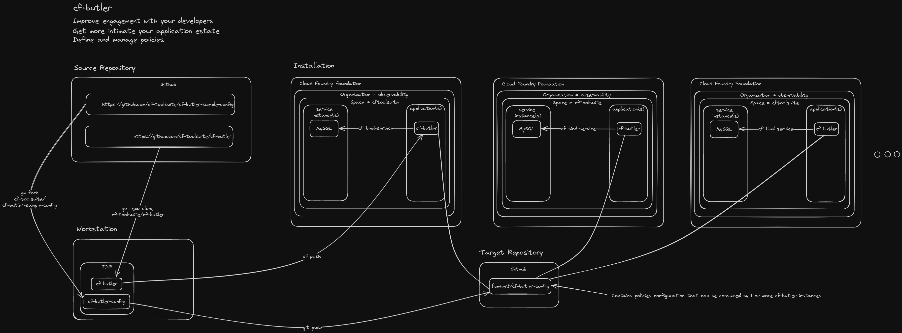

# VMware Tanzu Application Service > Butler

## Background

You are a platform operator working for a Fortune 500 enterprise.  You've witnessed first-hand how the product development teams your team supports are super productive; happily invoking `cf push`, `cf create-service` and `cf bind-service` many times per day to deploy applications, create services and bind them to those applications.

This is great, except that over time, on your non-production foundations, as you've browsed organizations and spaces, you have noticed a large number of stopped application instances and orphaned services (i.e., those not bound to any applications).

Reaching out to each development team to tell them to clean-up has become a chore.  Why not implement some automation that allows you a) to obtain snapshot and usage reports and b) define and enforce some house-keeping policies for your non-production foundations where applications and services are perhaps more volatile and c) easily handle multi-organization or system-wide use-cases like application instance scaling or stack changes?

This is where `cf-butler` has your back.

Cf-butler exposes a number of self-service endpoints that perform house-keeping for your foundation.  You define policies and an execution schedule.  E.g., applications and service instances could be removed based on policy criteria.  Cf-butler also provides detail and summary snapshot reporting on all applications, service instances, user accounts, organizations and spaces.  Lastly, cf-butler [aspires](https://github.com/cf-toolsuite/cf-butler/issues/62) to provide operators insight into the "freshness" of installed tiles, stemcells and buildpacks.

Cf-butler is configured and deployed as an application instance. Its capabilities overlap only on [accounting](https://docs.vmware.com/en/VMware-Tanzu-Application-Service/5.0/tas-for-vms/accounting-report.html) data collection from VMware Tanzu Application Service.  However, cf-butler performs other useful duties like a) snapshot usage reporting and b) policy registration and execution.

